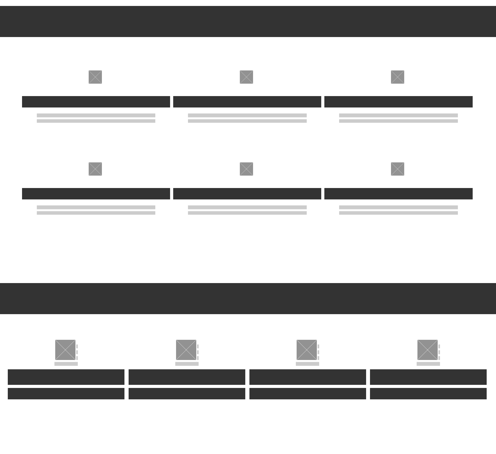

# School Term 1 Portfolio
Link to Portfolio:
Link to repo:
### Purpose
To showcase my understandng of HTML CSS And design theory. 
The portfolio should also express my personaility and professionalism to prospective employers.  

### Features
The webite is simple and repetitive but responsive. I wanted desktop users to be able to navigate away from the home page to see the images better. 
### Sitemap

 

### Screen Shots

 

### Target Audience 

Firstly the teachers marking the assignment and secondly prospective employers or collaborators. I was very weary of finding the balance between personality and professionalism.
  
### Tech Stack 

HTML 
CSS - mostly flexbox  
Tiny wee bit of Jscript from a tutorial I did 
Currently my contact section doesn't work but I plan to look in to PHP in order to utilise the form. 
## Design Documentation

### Process 
Initially I had a very simple website planned but reading the criteria revealed that this would not meet many of the requirements for the assignment. I decided early on to use Judit Just's weaving to create interest through texture. I knew that making my own original content would be too time consuming and I didnt want to spend too much time trolling through placeholdere content for things that were relfective of my personalaity and appropriate for a portfolio. 
### Wireframes

### Usability 

## Project Management
### Project Plan and Timeline
### Trello

# Q & A

### 1980
### Fundamentals
### One tech dev.