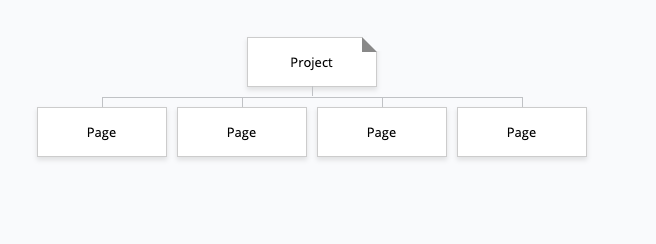

# School Term 1 Portfolio
Link to Portfolio: https://danakalee.github.io/portfolio/  
Link to repo:https://github.com/danakalee/portfolio  
### Purpose
To showcase my understandng of HTML CSS And design theory. 
The portfolio should also express my personaility and professionalism to prospective employers.  

### Features
The webite is simple and repetitive but responsive. I wanted desktop users to be able to navigate away from the home page to see the images better. 
### Sitemap

 

### Screen Shots

 

### Target Audience 

Firstly the teachers marking the assignment and secondly prospective employers or collaborators. I was very weary of finding the balance between personality and professionalism.
  
### Tech Stack 

HTML 
CSS - mostly flexbox  
Tiny wee bit of Jscript from a tutorial I did 
Currently my contact section doesn't work but I plan to look in to PHP in order to utilise the form.
  
## Design Documentation

### Process 
Initially I had a very simple website planned but reading the Rubric revealed that this would not meet many of the requirements for the assignment. I decided early on to use Judit Just's weaving to create interest through texture. I knew that making my own original content would be too time consuming and I didnt want to spend too much time trolling through placeholder content for things that were relfective of my personalaity and appropriate for a portfolio.  
I found working with Judit's content very joyful and I hope to make a better portfolio of her work as a project on my website. 
In my original design inspired by <mattfarley.ca> I had planned to use only Pantone's 'Living Coral' colour of the year for 2019. Realising that I needed to demonstrate 'consistent' use of colors I decided to find complimenting colors for Living Coral and feature Judits work more heavily in the the design of the website.  
I decided to use an image of the materials used in her work for my banner. I hope it conveys an idea of attention to detail and quality work. Working with textiles I have always found to be very medatitve so to help show some of my personality I included some phrases that I find comforting and indicative of the qualities I embody in the workplace.  
One of the struggles I faced with developing a portfolio when I have very little work to display was also contenting with just how many other places on the Internet a developer can have a presense. 
I decided that at present my portfolio would be best used at a landing page for my 'professional' social media. I made the links to these websites as prominate as possible. 
To show my html and css skills I used some effects on icons and hover over the images. Stylistically this is not to my liking but I wanted to demonstrate I was capable of doing so. I found the exercise very tedious. 
### Wireframes

### Usability 

All images and links have the correct alt tags but when I ran the google chrome accessibilty audit I was unable to get a consistent score. My images are large but the lag to load time was not too bothersome for my taste.   

I tried to keep the content on the website as minimal as possible so screen readers would find it easy to use. Colour and mouse hover functions do not convey priority or any other important information that would be lost on the visually impared.  

## Project Management

### Project Plan and Timeline

### Trello

# Q & A

### 1980

By the 80's the Internet is moving away from being only accessible by elite universities and the military. This decade sees a massive development in infrastructure like the T1 backbone and Ethernet and software like HTTP and DNS and hardware with IBM's PC with it's disk operating system. The internet experiences it's first attack - The Morris worm. During the 90's the free web is born. Browsers come and go, Mosaic, Napster and Google. Ecommerce arrives with SSL and ebay and Amazon can safely take payment. The backbone is upgraded to T3. The early 2000's see the rise of social media and by 2013 there are 2 billion users on the internet. There is regulation and huge sales for DNS with some domain names selling for millions of dollars. Most recently the internet has become a political tool and access to it is often limited by governments like in China and Egypt.  

### Fundamentals
 DNS is a protocol within the set of standards for how computers exchange data on the internet known as the TCP/IP protocol suite. 
When you connect to your internet service provider (ISP) the modem that assigns your computer's network address also sends some information to your computer. That configuration includes one or more DNS servers that the device should use when translating DNS names to IP address. 

The browser acts as a client to contact the web server and request information. First it performs a Domain Name System (DNS) look to find the IP address. Afterwards it sends a Hypertext Transfer Protocol (HTTP) request to the web server.  

When the request reaches the correct web server (hardware), the HTTP server (software) accepts request, finds the requested document (if it doesn't then a 404 response is returned), and sends it back to the browser, also through HTTP. 
 

### One tech dev.

By the early to mid-1970s,  ARPA found itself running three separate ‘experimental’ networks – ARPANET, PRNET, and SATNET – all of which used packet switching technology, but in different ways. 
Once again a sophisticated technology was in need of a way to communicate more effectively. In the end, the second option was adopted, and a suite of interlocking protocols centred on two new ones – TCP and IP – evolved. In this way TCP/IP became the cornerstone of the new ‘network of networks’. The great advantage of this approach was that implicit in it was the possibility of organic growth: as long as a given network ‘spoke’ TCP/IP (as it were) it was free to join the Internet. And because the system was not owned or controlled by anybody (unlike the ARPANET), there were no gatekeepers to control admission to it. In March 1981, the Pentagon announced that all ARPANET hosts would be required to adopt TCP/IP and in one move squashed any debate and the beginning of the free web was born.
